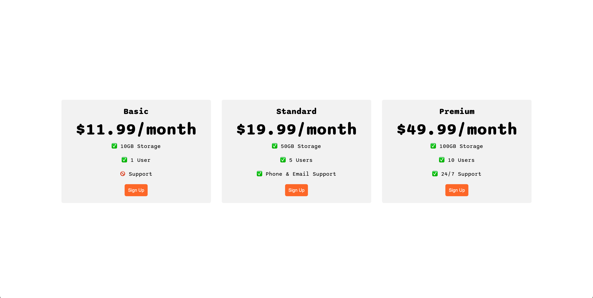
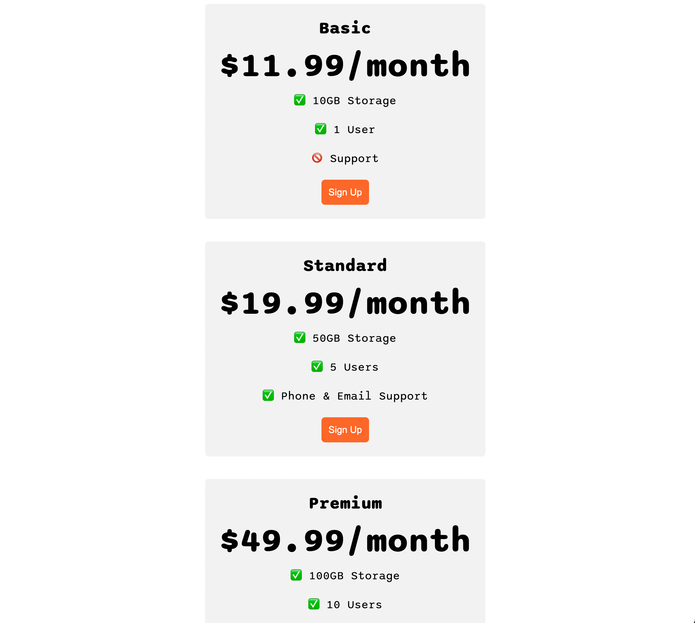

Here is a README file for your Flexbox Pricing Table project:

---

# Flexbox Pricing Table

This project demonstrates a responsive pricing table built using **HTML** and **CSS (Flexbox)**. The design is clean, modern, and adaptable to different screen sizes.

## Features

- **Responsive Design**: Automatically adjusts layout for desktop and mobile devices.
- **Plans**:
  - **Basic**: $9.99/month - 10GB Storage, 1 User, No Support.
  - **Standard**: $19.99/month - 50GB Storage, 5 Users, Phone & Email Support.
  - **Premium**: $49.99/month - 100GB Storage, 10 Users, 24/7 Support.
- **Styling**:
  - Utilizes **Flexbox** for layout.
  - Modern fonts from **Google Fonts** (Sono family).
  - Adaptive styles for different screen sizes using media queries.

## Screenshots

### Desktop View


### Mobile View


## How to Use

1. Clone this repository:
   ```bash
   git clone <repository_url>
   ```
2. Navigate to the project directory:
   ```bash
   cd flexbox_pricing_table_project-main
   ```
3. Open `index.html` in any web browser to view the pricing table.

## Customization

You can modify the following:
- **Colors**: Change in the `<style>` section of the HTML file.
- **Plans**: Update plan details (title, price, and features) within the `index.html` file.
- **Fonts**: Replace the Google Fonts link with your desired font.

## Technologies Used

- HTML5
- CSS3 (Flexbox)

## License

This project is open-source and available under the [MIT License](./LICENSE).

---

Let me know if you'd like any additional details added!
